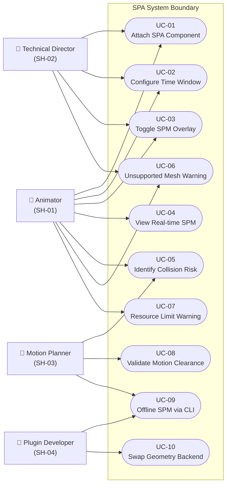

# Stage 2 — Stakeholders & Use Cases

**Project:** Swept Path Analysis (SPA)
**Status:** Draft — awaiting review
**Last updated:** 2026-04-22

---

## 1. Stakeholders

| ID | Role | Primary Interest | Interaction Mode |
|----|------|-----------------|-----------------|
| SH-01 | **Animator / Animation Artist** | Real-time collision visibility while authoring keyframe animation | Primary hands-on user of the SPA component in the UE5 Editor |
| SH-02 | **Technical Director (TD)** | Correct scene setup, component configuration, and pipeline integration | Configures SPA component properties; may script or template its use across a production |
| SH-03 | **Motion Planner / Systems Engineer** | Quantitative clearance analysis; timing and sequencing verification | Uses both the UE5 component (visual) and the CLI tool (offline batch analysis) |
| SH-04 | **Plugin Developer** | Code quality, maintainability, testability, and extensibility of the SPA codebase | Implements, tests, and evolves the SPA system; primary consumer of the modular backend interface (SC-09) |
| SH-05 | **Production Supervisor / Director** | Reduced motion-rework iterations; confidence that collision issues are caught early | Reviews SPM visualizations and collision warnings in review sessions |
| SH-06 | **Unreal Engine / Epic Games** | Platform API stability, plugin ecosystem conventions | External platform provider; defines API, Editor extension, and plugin constraints that SPA must operate within |

> **Note:** SH-01 and SH-02 are the primary drivers of functional requirements. SH-03 and SH-04 are the primary drivers of non-functional requirements (performance, accuracy, modularity). SH-05 shapes usability and reporting requirements. SH-06 constrains implementation choices.

---

## 2. Use Cases

### Use Case Summary Table

| ID | Name | Primary Actor | Brief Description |
|----|------|--------------|-------------------|
| UC-01 | Attach SPA Component to Actor | SH-01, SH-02 | Add the SPA component to an actor in the UE5 scene to begin swept path analysis on that actor |
| UC-02 | Configure Time Window | SH-01, SH-02 | Set the pre-frame duration, post-frame duration, and sample interval via the Details panel |
| UC-03 | Toggle SPM Overlay | SH-01, SH-02 | Enable or disable the SPM visualization overlay without removing the component from the actor |
| UC-04 | View Real-time SPM During Keyframe Editing | SH-01 | Observe the SPM overlay update automatically as keyframes are added, moved, or deleted |
| UC-05 | Identify Collision Risk | SH-01, SH-03 | Read the SPM overlay to determine whether the swept volume intersects scene geometry or other actors |
| UC-06 | Respond to Unsupported Mesh Warning | SH-01, SH-02 | Receive and act on an on-screen warning when the attached actor has a mesh type SPA cannot analyze (soft-body, cloth, fluid, non-affine rig) |
| UC-07 | Respond to Resource Limit Warning | SH-01, SH-02 | Receive an on-screen notification when system resources have forced a reduction in SPM quality (v2.0) |
| UC-08 | Validate Motion Clearance | SH-03 | Use the SPM overlay (and optionally the CLI tool) to formally verify that a motion sequence maintains required clearances throughout its duration |
| UC-09 | Compute Offline SPM via CLI | SH-03, SH-04 | Run the standalone CGAL CLI tool to generate a SPM mesh file from a mesh + transforms CSV, for offline analysis or reference comparison |
| UC-10 | Swap Geometry Backend | SH-04 | Replace the active geometry processing implementation (e.g., CGAL → OpenVDB) via the backend interface without modifying the SPA component's public API |

---

## 3. Use Case Diagram

---

## 4. Use Case Details

### UC-01 — Attach SPA Component to Actor

**Primary actor:** SH-01 (Animator), SH-02 (TD)
**Preconditions:** An actor with a static mesh exists in the UE5 scene; SPA plugin is installed and enabled.
**Main flow:**
1. Actor is selected in the Outliner or Viewport.
2. User opens the **Details** panel and clicks **Add Component**.
3. User selects **SPA Component** from the component list.
4. The component initializes with default settings; the SPM overlay is disabled by default.

**Postconditions:** SPA Component is attached to the actor and visible in the component hierarchy. No SPM is visible until the overlay is enabled (UC-03).
**Exceptions:** If the actor's mesh is an unsupported type, the component attaches but immediately posts a warning (UC-06).

---

### UC-02 — Configure Time Window

**Primary actor:** SH-01, SH-02
**Preconditions:** SPA Component is attached to an actor (UC-01).
**Main flow:**
1. User selects the actor and finds the SPA Component in the Details panel.
2. User sets **Pre-Frame Duration** (seconds before the current playhead).
3. User sets **Post-Frame Duration** (seconds after the current playhead).
4. User sets **Sample Interval** (time between sampled poses).
5. Component recomputes the SPM with the new parameters (if overlay is enabled).

**Postconditions:** SPM reflects the newly configured time window on next update cycle.
**Exceptions:** If the configured sample count would exceed the resource budget, a warning is shown and the interval is auto-adjusted (v2.0 dynamic quality management).

---

### UC-03 — Toggle SPM Overlay

**Primary actor:** SH-01, SH-02
**Preconditions:** SPA Component is attached to an actor (UC-01).
**Main flow:**
1. User locates the **Enable SPM Overlay** toggle in the Details panel.
2. User sets the toggle ON or OFF.
3. If ON: SPM geometry is computed and the overlay renders in the viewport.
4. If OFF: SPM geometry is hidden; no computation occurs.

**Postconditions:** Overlay visibility matches the toggle state. Performance impact is zero when disabled.

---

### UC-04 — View Real-time SPM During Keyframe Editing

**Primary actor:** SH-01
**Preconditions:** SPA Component is attached and overlay is enabled (UC-01, UC-03). The actor has an animation sequence with at least one keyframe.
**Main flow:**
1. Animator moves, adds, or deletes a keyframe in the **Sequencer** or **Animation Editor**.
2. SPA Component detects the animation change via an Editor subsystem callback.
3. SPM is recomputed asynchronously (or synchronously if fast enough).
4. Updated SPM overlay renders in the viewport within the latency budget defined in Stage 4.

**Postconditions:** The SPM overlay reflects the actor's swept volume for the updated animation within the configured time window.
**Exceptions:** If the recompute exceeds the latency budget, the overlay may display the prior SPM with a "Recomputing..." indicator until the update completes.

---

### UC-05 — Identify Collision Risk

**Primary actor:** SH-01, SH-03
**Preconditions:** SPM overlay is active and up to date (UC-04).
**Main flow:**
1. User visually inspects the semi-transparent SPM overlay in the viewport.
2. User identifies regions where the SPM intersects scene geometry or other actors.
3. User adjusts keyframes or scene geometry to resolve the collision.
4. SPM updates and the user confirms clearance.

**Postconditions:** The user has made an informed determination about collision clearance for the animated sequence.
**Notes:** SPA visualizes; it does not automatically detect or report specific intersection geometry in v1.0. Collision detection in the overlay is a v2.0+ candidate.

---

### UC-06 — Respond to Unsupported Mesh Warning

**Primary actor:** SH-01, SH-02
**Preconditions:** SPA Component is attached to an actor whose mesh is soft-body, cloth, fluid, or uses non-affine rigging.
**Main flow:**
1. SPA Component detects the unsupported mesh type during initialization or on actor change.
2. An on-screen warning appears in the Editor viewport for 15 seconds.
3. The warning is also written to the UE5 Output Log panel.
4. The SPM overlay does not render; the component remains attached but inactive.

**Postconditions:** User is informed of the limitation. The component does not crash or produce incorrect output.

---

### UC-07 — Respond to Resource Limit Warning *(v2.0)*

**Primary actor:** SH-01, SH-02
**Preconditions:** SPA Component is active; system resource utilization has exceeded the defined threshold.
**Main flow:**
1. The resource monitor (running at a low-frequency check interval) detects that CPU/memory usage exceeds the threshold.
2. SPA Component reduces time window duration and/or sample interval to lower computation load.
3. An on-screen warning appears for 15 seconds; the warning is also logged to the Output panel.
4. When resources become available again, the component incrementally restores configured values.

**Postconditions:** SPM continues to display at reduced fidelity; user is aware of the degradation.

---

### UC-08 — Validate Motion Clearance

**Primary actor:** SH-03
**Preconditions:** Animation sequence is finalized or at a review milestone. SPA Component is configured with the required time window.
**Main flow:**
1. Motion Planner enables the SPM overlay for the target actor.
2. Scrubs or plays the animation sequence through its full range.
3. Inspects the SPM at each critical phase of the motion.
4. Optionally runs the CLI tool (UC-09) to generate a mesh file for quantitative comparison against CAD clearance envelopes.
5. Documents findings: pass/fail for each clearance requirement.

**Postconditions:** A formal clearance determination is made against the requirements established in Stage 3.

---

### UC-09 — Compute Offline SPM via CLI

**Primary actor:** SH-03, SH-04
**Preconditions:** CGAL CLI tool is built and accessible. A mesh file and a transforms CSV are available.
**Main flow:**
1. User prepares a `config.ini` specifying the base mesh, transforms CSV, and output path.
2. User runs `BooleanOp.exe` and enters the config file path.
3. Tool processes all transform samples and writes the SPM mesh file.
4. User imports or inspects the output mesh.

**Postconditions:** A mesh file representing the swept volume is produced. Benchmark data (step time, vertex/face counts, memory) is printed to the console.
**Notes:** This is the current prototype capability and is maintained as the reference implementation and regression baseline.

---

### UC-10 — Swap Geometry Backend

**Primary actor:** SH-04
**Preconditions:** The SPA plugin uses the backend interface (SC-09). An alternative backend implementation exists (e.g., OpenVDB, OCCT).
**Main flow:**
1. Developer implements the geometry backend interface for the target library.
2. Developer updates the factory / dependency injection point to select the new backend.
3. Developer runs the V&V suite to confirm the new backend produces correct SPM output.
4. The SPA Component and all higher-level code are unchanged.

**Postconditions:** SPA operates using the new geometry backend with no public API changes.

---

## 5. Risks Identified at This Stage

| ID | Risk | Likelihood | Impact | Mitigation |
|----|------|-----------|--------|------------|
| R-07 | UE5 Editor does not expose a per-keyframe-change callback sufficient for real-time SPM updates (UC-04) | Medium | High | Investigate `FEditorDelegates`, `UAnimSequence` modification hooks, and Sequencer event bindings during Stage 5 system boundary analysis |
| R-08 | Future frame prediction for post-playhead SPM requires reading animation data ahead of current time, which may require Animation Asset API access not exposed by standard Actor components | Medium | Medium | Confirm API availability during Stage 5; scope v1.0 to pre-frame-only if post-frame turns out to require PIE |
