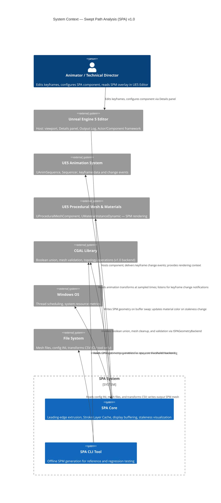
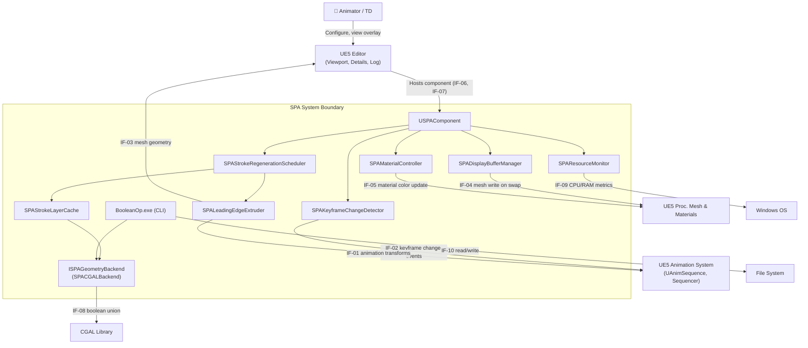

# Stage 5 — System Boundaries & External Interfaces

**Project:** Swept Path Analysis (SPA)
**Status:** Draft — awaiting review
**Last updated:** 2026-04-22

---

## 1. System Boundary Definition

The SPA system boundary encompasses all code, data structures, and logic that are authored and owned by this project. Everything outside that boundary is an external dependency consumed through a defined interface.

### Inside the SPA System Boundary

| Component | Description |
|-----------|-------------|
| `USPAComponent` | UE5 Actor Component; entry point for all user interaction and Editor integration |
| `SPAStrokeLayerCache` | Hierarchical four-level mesh cache; manages Layer-0 through Layer-3 segments |
| `SPAKeyframeChangeDetector` | Monitors animation data for changes; computes invalidation ranges across channels |
| `SPAStrokeRegenerationScheduler` | Dispatches Layer-3 segment generation to background threads; manages priority and ordering |
| `SPALeadingEdgeExtruder` | Core algorithm: classifies vertices, generates bridge faces, produces prism volumes per interval |
| `ISPAGeometryBackend` | Abstract C++ interface for all geometry operations (union, cleanup, simplification, validation) |
| `SPACGALBackend` | CGAL implementation of `ISPAGeometryBackend` (v1.0 default) |
| `SPADisplayBufferManager` | Maintains display and update buffers; executes atomic buffer swap on game thread |
| `SPAMaterialController` | Sets normal / stale hue on the overlay material instance in response to buffer state changes |
| `SPAResourceMonitor` | Polls system resource utilization at low frequency; triggers warnings when thresholds are exceeded |
| `BooleanOp.exe` (CLI tool) | Standalone offline reference implementation; shares geometry logic with `SPACGALBackend` |

### Outside the SPA System Boundary

| External System | Role |
|----------------|------|
| Unreal Engine 5 Editor | Host environment: viewport, Details panel, Output Log, Actor/Component framework, rendering pipeline |
| UE5 Animation System | Provides animation transform data (`UAnimSequence`, Sequencer) and keyframe change events |
| UE5 Procedural Mesh System | Renders the SPM overlay (`UProceduralMeshComponent`, `UMaterialInstanceDynamic`) |
| CGAL Library | Geometry kernel accessed through `ISPAGeometryBackend`; not directly called by any SPA component above the backend layer |
| Windows OS | Thread scheduling, memory/CPU metrics |
| File System | CLI tool I/O only; not used by the UE5 plugin path |

---

## 2. System Context Diagram

---

## 3. External Interface Specifications

Each interface is described with: direction, protocol, data exchanged, call frequency, and any open questions or risks.

---

### IF-01 — Animation Transform Evaluation

| Attribute | Detail |
|-----------|--------|
| **Direction** | SPA reads from UE5 Animation System |
| **Protocol** | C++ API — `UAnimSequence::EvaluateAnimation()` or equivalent UE5 pose evaluation function |
| **Data exchanged** | `FTransform` (world-space position, rotation, scale) of the actor's root at a specified time `t` |
| **Call frequency** | Once per sample point per regeneration cycle; at C-06 parameters: up to 7,200 calls per full rebuild |
| **Threading** | Must be called from a thread that holds the UE5 game object safely; may need marshalling from background threads |
| **Open question** | **OQ-07** — Can this API be called efficiently for 7,200 time points without per-call overhead that dominates NFR-03 latency? Investigated in Stage 11 spike. |
| **Fallback** | Pre-evaluate all sample transforms on the game thread in a single pass before dispatching background work; cache in a `TArray<FTransform>` |

---

### IF-02 — Keyframe Change Notification

| Attribute | Detail |
|-----------|--------|
| **Direction** | UE5 pushes to SPA (preferred) or SPA polls UE5 (fallback) |
| **Protocol (preferred)** | UE5 Editor delegate / event system — candidate APIs: `ISequencer::OnMovieSceneDataChanged`, `FCoreUObjectDelegates::OnObjectPropertyChanged`, or `UAnimSequence` asset modification hooks |
| **Protocol (fallback)** | Polling on a configurable interval (e.g., 100 ms tick) comparing a hash or dirty flag on the animation asset |
| **Data exchanged** | Notification that animation data has changed; ideally includes the time range and channel affected (to compute the exact invalidation range per FR-16); at minimum, a "something changed" signal that triggers a full-range invalidation scan |
| **Call frequency** | Event-driven (push) or every 100 ms (poll fallback) |
| **Open question** | **OQ-06** — Does UE5 5.4+ expose a per-keyframe-change notification usable in Editor mode without PIE? This is the single most critical API dependency for real-time Editor behavior. Investigated in Stage 5 research (see §5 below) and confirmed in Stage 11 spike. |
| **Fallback** | If push notification is unavailable, use polling. Performance impact: polling every 100 ms is negligible; the cost is the false-positive invalidation when no change occurred, which is mitigated by comparing a cached animation fingerprint before triggering recomputation. |

---

### IF-03 — Actor Mesh Geometry Access

| Attribute | Detail |
|-----------|--------|
| **Direction** | SPA reads from UE5 Actor/Mesh system |
| **Protocol** | `AActor::GetComponentByClass<UStaticMeshComponent>()`, `UStaticMesh::GetLODData(0)`, `FStaticMeshLODResources::VertexBuffers` |
| **Data exchanged** | Triangle mesh: vertex positions, vertex normals, face index buffer (LOD 0) |
| **Call frequency** | Once at component initialization; re-read if the mesh asset reference changes |
| **Notes** | LOD-0 is used for SPA computation (highest fidelity). The mesh geometry is treated as static for the duration of a sweep — skeletal mesh deformation during sweep is out of scope (v1.0). |

---

### IF-04 — Procedural Mesh Write (SPM Rendering)

| Attribute | Detail |
|-----------|--------|
| **Direction** | SPA writes to UE5 Procedural Mesh System |
| **Protocol** | `UProceduralMeshComponent::CreateMeshSection_LinearColor()` (first write), `UpdateMeshSection_LinearColor()` (buffer swap) |
| **Data exchanged** | Vertex positions (`TArray<FVector>`), normals (`TArray<FVector>`), indices (`TArray<int32>`) |
| **Call frequency** | Once per buffer swap (FR-42); at most once per update cycle |
| **Threading constraint** | **Must execute on the game thread.** SPM computation runs on background threads; the final mesh upload is marshalled to the game thread via `AsyncTask(ENamedThreads::GameThread, ...)` or equivalent |
| **Notes** | The buffer swap and mesh upload are the only game-thread-bound operations in the update path; all CGAL work is background-thread eligible |

---

### IF-05 — Material Parameter Update (Staleness Hue)

| Attribute | Detail |
|-----------|--------|
| **Direction** | SPA writes to UE5 Material System |
| **Protocol** | `UMaterialInstanceDynamic::SetVectorParameterValue(FName("SPAColor"), FLinearColor(...))` |
| **Data exchanged** | `FLinearColor` — normal color or stale color (see §3.4 of Stage 4 for defaults) |
| **Call frequency** | Twice per update cycle: once on invalidation detection (set stale color), once on buffer swap completion (set normal color) |
| **Threading constraint** | Must execute on game thread; both calls are lightweight and non-blocking |

---

### IF-06 — UE5 Output Log

| Attribute | Detail |
|-----------|--------|
| **Direction** | SPA writes to UE5 |
| **Protocol** | `UE_LOG(LogSPA, Warning, TEXT("..."))` macros with a dedicated `DEFINE_LOG_CATEGORY(LogSPA)` |
| **Data exchanged** | Formatted UTF-16 text strings |
| **Call frequency** | On warning events, status transitions, and recomputation start; never per-tick |

---

### IF-07 — On-Screen Debug Overlay (Warnings)

| Attribute | Detail |
|-----------|--------|
| **Direction** | SPA writes to UE5 Editor |
| **Protocol** | `GEngine->AddOnScreenDebugMessage(Key, 15.0f, Color, Message)` for 15-second timed display; or UE5 Editor notification toast via `FNotificationInfo` |
| **Data exchanged** | Warning text string, display duration (15 s), color |
| **Call frequency** | On warning events only |
| **Notes** | `FNotificationInfo` (Editor notification toast) is preferred over `AddOnScreenDebugMessage` in Editor mode — it uses the standard UE5 notification UI rather than the debug overlay typically used in PIE. Both will be investigated during Stage 11. |

---

### IF-08 — CGAL Geometry Backend

| Attribute | Detail |
|-----------|--------|
| **Direction** | SPA calls CGAL |
| **Protocol** | C++ function calls via `ISPAGeometryBackend` virtual interface; CGAL internals are not directly accessible from outside `SPACGALBackend` |
| **Data exchanged** | Input: `CGAL::Surface_mesh` (prism volume or accumulated stroke); Output: `CGAL::Surface_mesh` (union result); error codes / exception signals |
| **Call frequency** | Once per Layer-3 segment per boolean union step; up to O(7,200) calls per full rebuild |
| **Threading constraint** | CGAL's thread-safety is partial (see R-14); `SPACGALBackend` shall use **separate CGAL object instances per thread** to avoid shared state |
| **Error handling** | If CGAL throws or returns an invalid mesh, `ISPAGeometryBackend` catches the exception, logs it via IF-06, and returns a failure code to the scheduler; the display buffer is not updated for that segment |

---

### IF-09 — Windows System Resource Metrics

| Attribute | Detail |
|-----------|--------|
| **Direction** | SPA reads from Windows OS |
| **Protocol** | `FPlatformMemory::GetStats()` (UE5 cross-platform) for memory; `FPlatformTime::GetCPUTime()` or Windows `GetSystemTimes()` for CPU utilization |
| **Data exchanged** | Available RAM (bytes), CPU utilization (%) |
| **Call frequency** | Every 5 seconds (FR-V2-03 default) — polling only, never per-tick |
| **Notes** | Using UE5 platform abstraction APIs (`FPlatformMemory`) keeps the monitoring code cross-platform even though the primary target is Windows |

---

### IF-10 — File System (CLI Tool Only)

| Attribute | Detail |
|-----------|--------|
| **Direction** | CLI tool reads and writes |
| **Protocol** | Standard C++ file I/O (`std::ifstream`, `std::ofstream`); CGAL I/O for mesh formats |
| **Data exchanged** | Input: config `.ini`, mesh files (`.off`, `.obj`, `.ply`, `.stl`), transforms `.csv`; Output: result mesh file |
| **Call frequency** | Once per CLI invocation |
| **Notes** | FBX format is the target for the UE5 plugin path, but the CLI tool retains its existing `.off`/`.obj` support for regression testing |

---

## 4. Interface Dependency Map

---

## 5. OQ-06 Investigation — UE5 Keyframe Change Notification APIs

This is the highest-priority open question carried from Stage 4. Based on publicly available UE5 documentation and source, the following candidate APIs are identified for investigation during Stage 11:

| Candidate API | Availability | Granularity | Notes |
|--------------|-------------|-------------|-------|
| `ISequencer::OnMovieSceneDataChanged` | Editor only (not PIE required) | Sequence-level — signals any change to the sequence data | Most likely candidate for the Sequencer workflow; does not specify which keyframe changed |
| `FCoreUObjectDelegates::OnObjectPropertyChanged` | Editor mode | Property-level — fires when any UObject property changes | Can be filtered to `UAnimSequence` property changes; may fire too broadly |
| `UAnimSequence` asset modification delegate | Editor only | Asset-level | Fires when the asset is marked dirty; coarser than keyframe-level |
| Sequencer `FMovieSceneTrack::OnChanged` | Editor only | Track-level | More granular; may not be publicly exposed as a stable API |
| Polling fallback | Always | User-configurable interval (default 100 ms) | Guaranteed to work; adds minor latency equal to poll interval |

**Conclusion for architecture:** Stage 8 must design the `SPAKeyframeChangeDetector` to support both a push-notification path and a polling fallback, selected at runtime based on API availability. The polling fallback is the guaranteed-safe path; push notification is the performance optimization. This is a direct consequence of OQ-06 remaining open.

---

## 6. Risks Identified at This Stage

| ID | Risk | Likelihood | Impact | Mitigation |
|----|------|-----------|--------|------------|
| R-16 | `UAnimSequence::EvaluateAnimation()` requires game thread access and cannot be called safely from background threads, blocking parallel Layer-3 computation | Medium | High | Pre-evaluate all sample transforms on game thread in a single batch before dispatching background work; cache in `TArray<FTransform>`; background threads receive read-only transform data |
| R-17 | `UProceduralMeshComponent::UpdateMeshSection_LinearColor()` is too slow for the SPM vertex/index count at C-06 parameters, creating a game-thread stall during buffer swap | Low | Medium | Profile in Stage 11; if too slow, use a static mesh asset rebuilt via `FStaticMeshRenderData` or Geometry Script as an alternative |
| R-18 | `AddOnScreenDebugMessage` is only visible in PIE; Editor-mode warnings require the `FNotificationInfo` toast system, which has different API signatures and lifetime behavior | Medium | Low | Test both paths in Stage 11; prefer `FNotificationInfo` for Editor mode; `AddOnScreenDebugMessage` for PIE/runtime mode |
