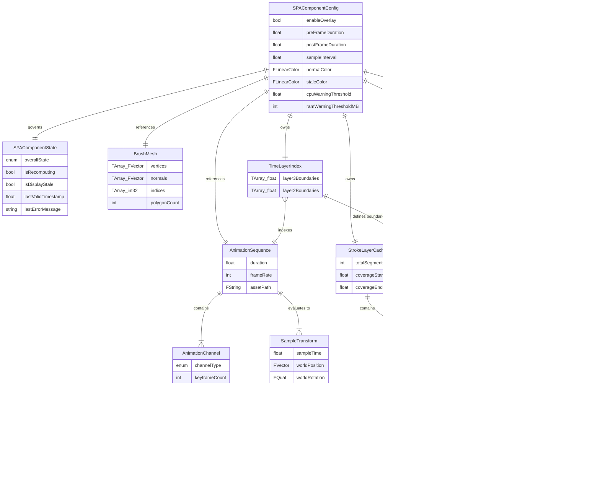

# Stage 6 — Abstract Data Model

**Project:** Swept Path Analysis (SPA)
**Status:** Draft — awaiting review
**Last updated:** 2026-04-22

---

## 1. Entity Descriptions

The following entities represent the significant data structures in the SPA system. Transient entities (created and discarded within a single computation step) are marked **[transient]**.

| ID | Entity | Description | Persistence |
|----|--------|-------------|------------|
| E-01 | **BrushMesh** | The actor's static mesh geometry: vertex positions, vertex normals, and face index buffer. Read once at component initialization; treated as immutable during a sweep. | Lifetime of SPA component |
| E-02 | **AnimationSequence** | The source of all motion data. Contains one or more AnimationChannels; owned by UE5, referenced by SPA. Mutated externally when the animator edits keyframes. | External (UE5 asset) |
| E-03 | **AnimationChannel** | A single animated parameter track (e.g., Translate X, Rotate Z). Owns an ordered list of Keyframes. | Part of E-02 |
| E-04 | **Keyframe** | A single time-value pair on one AnimationChannel. The fundamental unit of change that drives SPM invalidation. | Part of E-03 |
| E-05 | **SampleTransform** | The evaluated world-space transform (position, rotation, scale) of the actor's root at a specific sample time `t`. Computed by evaluating E-02 at `t`. | In-memory array during rebuild |
| E-06 | **LeadingEdgeSet** | The classified subset of E-01 vertices and polygons that are "forward-facing" for a specific interval [tᵢ, tᵢ₊₁]. Derived from two consecutive SampleTransforms. | **[transient]** |
| E-07 | **PrismVolume** | A closed, watertight prism mesh generated by extruding one LeadingEdgeSet from pose tᵢ to tᵢ₊₁ via bridge faces. The atomic geometry contribution of one interval. | **[transient]** |
| E-08 | **StrokeSegment** | A cached SPM mesh covering a specific time range, at one of the four cache layers (0–3). The central persistent data entity of the system. Has a validity state lifecycle. | StrokeLayerCache |
| E-09 | **StrokeLayerCache** | The collection of all StrokeSegments organized into four hierarchical layers. Manages segment validity, triggers regeneration, and owns the Layer-0 segment used for display. | Lifetime of SPA component |
| E-10 | **TimeLayerIndex** | The keyframe time-boundary index that defines the time ranges of Layer-3 StrokeSegments. Built from all AnimationChannels. Updated when keyframes are added, removed, or moved. | Lifetime of SPA component |
| E-11 | **InvalidationRange** | A time interval [start, end] computed as the union of affected keyframe intervals across all channels when a keyframe change is detected. Consumed immediately to mark StrokeSegments stale. | **[transient]** |
| E-12 | **DisplayBuffer** | Holds the mesh data and material state of the SPM currently visible in the viewport. Swapped atomically with the UpdateBuffer when a new Layer-0 result is ready. | Lifetime of SPA component |
| E-13 | **UpdateBuffer** | Receives the newly computed Layer-0 mesh during background recomputation. Promoted to DisplayBuffer via atomic swap on completion. | Lifetime of SPA component |
| E-14 | **SPAComponentConfig** | All user-configurable properties: enable toggle, pre/post frame durations, sample interval, normal color, stale color, resource warning thresholds. | Serialized with UE5 Actor |
| E-15 | **SPAComponentState** | Runtime-only state of the component: current validity, recomputation progress, last successful update timestamp. Not serialized. | Runtime only |
| E-16 | **GeometryBackendResult** | Return value from a single `ISPAGeometryBackend` operation: success flag, output mesh (on success), error message (on failure). | **[transient]** |

---

## 2. Entity Relationship Diagram



---

## 3. Primary Data Flow

The diagram below traces how data moves from the animation asset through the computation pipeline to the visible overlay.

```mermaid
flowchart LR
    A["AnimationSequence\n(UE5 asset)"]
    B["SampleTransform[ ]\n(evaluated poses)"]
    C["LeadingEdgeSet\n(per interval)"]
    D["PrismVolume\n(per interval)"]
    E["StrokeSegment\n(Layer-3, per keyframe interval)"]
    F["StrokeSegment\n(Layer-2, merged)"]
    G["StrokeSegment\n(Layer-1, merged)"]
    H["StrokeSegment\n(Layer-0, full timeline)"]
    I["UpdateBuffer"]
    J["DisplayBuffer\n(visible overlay)"]

    BRUSH["BrushMesh"]

    A -->|"evaluate at sample times\n(IF-01)"| B
    BRUSH --> C
    B --> C
    C -->|"classify + extrude"| D
    D -->|"boolean union\n(IF-08 / CGAL)"| E
    E -->|"merge pairs"| F
    F -->|"merge pairs"| G
    G -->|"merge pair"| H
    H -->|"write to"| I
    I -->|"atomic swap\n(game thread)"| J
```



---

## 4. State Diagrams

### 4.1 StrokeSegment Validity State

Each cached mesh segment independently tracks its own validity. The scheduler reads this state to decide which segments to recompute.

```mermaid
stateDiagram-v2
    [*] --> VALID : Initial computation complete

    VALID --> STALE : Keyframe change invalidates\nthis segment's time range
    STALE --> COMPUTING : Scheduler dispatches\nbackground recomputation
    COMPUTING --> VALID : Computation succeeds;\nnew mesh stored
    COMPUTING --> ERROR : CGAL exception or\ninvalid mesh result
    ERROR --> STALE : Retry triggered\n(next change event or manual retry)
    STALE --> STALE : Additional keyframe changes\nwhile already stale (no-op)

    note right of COMPUTING : Segment's previous mesh\nis retained while computing.\nUpper layers remain valid\nuntil this segment completes.
```



### 4.2 DisplayBuffer / UpdateBuffer State

The two-buffer system ensures the viewport never shows a blank or partial overlay. Both buffers have coordinated state.

```mermaid
stateDiagram-v2
    state DisplayBuffer {
        [*] --> CURRENT
        CURRENT --> STALE : Layer-0 StrokeSegment\ninvalidated; stale\nhue applied (IF-05)
        STALE --> CURRENT : Swap complete;\nnormal hue restored (IF-05)
    }

    state UpdateBuffer {
        [*] --> IDLE
        IDLE --> COMPUTING : Layer-0 recomputation\ndispatched
        COMPUTING --> READY : New Layer-0 mesh\nfully computed
        READY --> IDLE : Atomic swap to\nDisplayBuffer complete
    }

    READY --> STALE : triggers swap
```

### 4.3 SPAComponent Overall State

The top-level state visible to the animator. Drives the staleness hue, warning messages, and scheduler activity.

```mermaid
stateDiagram-v2
    [*] --> DISABLED : Component attached;\noverlay toggle = off

    DISABLED --> IDLE : Overlay toggled ON;\ninitial SPM computed
    IDLE --> DISABLED : Overlay toggled OFF

    IDLE --> RECOMPUTING : Keyframe change\ndetected (IF-02)
    RECOMPUTING --> IDLE : Layer-0 buffer\nswap complete
    RECOMPUTING --> RECOMPUTING : Additional keyframe\nchanges during recomputation\n(invalidation range expands)

    IDLE --> ERROR : Geometry backend\nreturns repeated failures
    RECOMPUTING --> ERROR : Geometry backend\nreturns repeated failures
    ERROR --> RECOMPUTING : User action or\nautomatic retry

    note right of RECOMPUTING : DisplayBuffer shows last\nvalid SPM with stale hue.\nBackground threads active.
    note right of ERROR : DisplayBuffer shows\nlast valid SPM.\nPersistent warning shown.
```



---

## 5. Key Data Constraints

| Constraint | Entity/Field | Rule |
|-----------|-------------|------|
| DC-01 | BrushMesh.polygonCount | Must be > 0; must be a triangulated mesh (all faces have exactly 3 vertices) at time of SPA initialization |
| DC-02 | SPAComponentConfig.sampleInterval | Must be > 0; minimum value: 1/sampleRate (cannot request more samples than the animation frame rate supports) |
| DC-03 | SPAComponentConfig.preFrameDuration, postFrameDuration | Each must be ≥ 0; total window (pre + post) must be > 0 |
| DC-04 | StrokeSegment.timeRangeStart/End | End > Start; ranges within the same layer must be non-overlapping and contiguous |
| DC-05 | TimeLayerIndex.layer3Boundaries | Must include a boundary at every keyframe time across all AnimationChannels; boundaries are in ascending order |
| DC-06 | DisplayBuffer ↔ UpdateBuffer | Exactly one of these holds the "current display" mesh at any time; the swap is atomic — no frame renders a partially-swapped state |
| DC-07 | SampleTransform.sampleTime | Must fall within [AnimationSequence.startTime, AnimationSequence.startTime + duration] |
| DC-08 | PrismVolume | Must be a closed, watertight mesh before being passed to the geometry backend; an open prism volume is a fatal computation error for that interval |

---

## 6. Entity Sizing Estimates at C-06 Parameters

Provided as rough sizing guidance for the memory budget (NFR-04: ≤ 256 MB total cache).

| Entity | Count at C-06 | Estimated Size | Notes |
|--------|--------------|----------------|-------|
| BrushMesh | 1 | ~18 KB | 150 polys × ~120 bytes/poly (vertices + normals + indices) |
| SampleTransform array | 7,200 | ~576 KB | 7,200 × 80 bytes (FTransform) |
| StrokeSegment (Layer-3) | ~20–100 | ~1–5 MB total | Depends on keyframe density; each segment is a union of N prism volumes |
| StrokeSegment (Layer-2) | ~10–50 | ~5–20 MB total | Merged from Layer-3; larger meshes |
| StrokeSegment (Layer-1) | 2 | ~10–40 MB total | Each is half the full timeline |
| StrokeSegment (Layer-0) | 1 (×2 with buffers) | ~20–80 MB | Full SPM; 2 copies for display/update buffers |
| **Total estimate** | — | **~50–150 MB** | Well within 256 MB target; dominated by Layer-0 and Layer-1 |

---

## 7. Risks Identified at This Stage

| ID | Risk | Likelihood | Impact | Mitigation |
|----|------|-----------|--------|------------|
| R-19 | Layer-3 segment count is unpredictable at runtime — animations with very dense keyframing (e.g., motion-capture data at 120 fps) could produce thousands of Layer-3 segments, blowing the memory budget | Medium | Medium | Cap Layer-3 segment count at a configurable maximum; merge over-dense keyframe intervals into coarser Layer-3 segments when the cap is approached |
| R-20 | The atomic buffer swap (DC-06) requires that the game thread never reads DisplayBuffer while the swap is in progress; if UProceduralMeshComponent polls the mesh data mid-frame, a race condition exists | Low | High | Use a mutex or UE5's render-thread fence mechanism to guarantee the swap completes between render frames, not during one |
