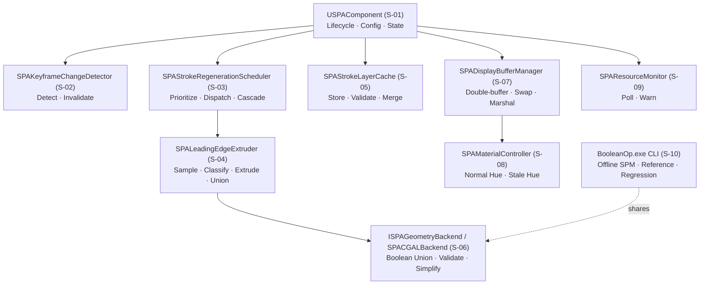
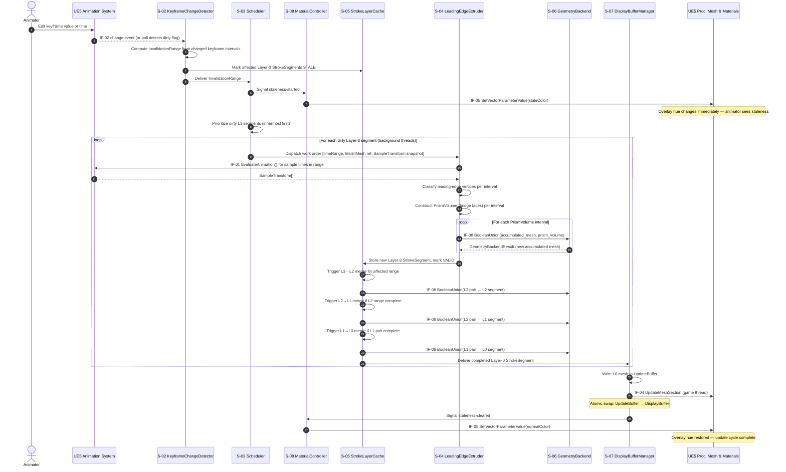
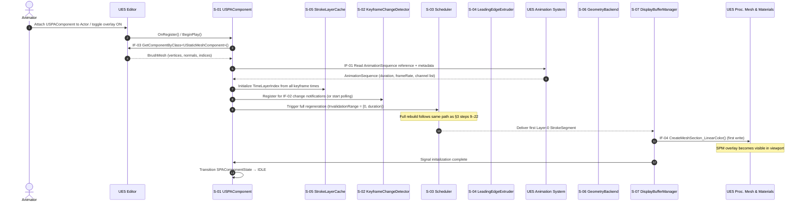
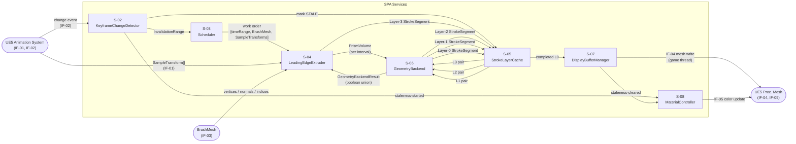

# Stage 7 — Abstract Functional Model

**Project:** Swept Path Analysis (SPA)
**Status:** Draft — awaiting review
**Last updated:** 2026-04-22

---

## 1. Service Catalog

Each service listed here corresponds to a component inside the SPA system boundary (established in Stage 5). This section defines what each service is *responsible for* and what it *does not own* — the latter being as important as the former for avoiding scope creep in Stage 8 architecture decisions.

| ID | Service | Single-Sentence Responsibility | Inputs | Outputs | Owned Stage-6 Entities |
|----|---------|-------------------------------|--------|---------|------------------------|
| S-01 | `USPAComponent` | Top-level lifecycle owner: initializes all sub-services, gates all user-visible state, and routes external events inward | UE5 attach/detach events, `SPAComponentConfig` changes from Details panel | Delegates to sub-services; owns `SPAComponentState` transitions | `SPAComponentConfig`, `SPAComponentState` |
| S-02 | `SPAKeyframeChangeDetector` | Detects that animation data has changed and produces a precise `InvalidationRange` covering all affected time intervals | IF-02 push event or periodic poll; current `TimeLayerIndex` | `InvalidationRange` delivered to Scheduler (S-03) | `InvalidationRange` (transient) |
| S-03 | `SPAStrokeRegenerationScheduler` | Prioritizes and dispatches Layer-3 segment recomputation to background threads; triggers the upward merge cascade when a Layer-3 result arrives | `InvalidationRange` from S-02; Layer-3 `StrokeSegment` validity state from Cache (S-05) | Work orders to S-04 (Extruder); merge-cascade triggers to S-05 | None — reads/writes segments via S-05 |
| S-04 | `SPALeadingEdgeExtruder` | Core geometry algorithm: evaluates animation transforms, classifies leading-edge vertices, constructs bridge faces, produces `PrismVolume` meshes, and calls the geometry backend to union them into a Layer-3 `StrokeSegment` | `BrushMesh`, `SampleTransform[]`, `ISPAGeometryBackend` (S-06) | One `StrokeSegment` (Layer-3) per assigned time interval, written to Cache (S-05) | `LeadingEdgeSet` (transient), `PrismVolume` (transient), `SampleTransform` (transient), `GeometryBackendResult` (transient) |
| S-05 | `SPAStrokeLayerCache` | Stores all `StrokeSegment` instances across Layers 0–3, tracks their validity state, and triggers the merge cascade (L3→L2→L1→L0) when new results arrive | New `StrokeSegment` results from S-04 and merge operations; validity-change signals from S-03 | Validity-state changes; completed L0 `StrokeSegment` delivered to S-07 | `StrokeLayerCache`, `StrokeSegment`, `TimeLayerIndex` |
| S-06 | `ISPAGeometryBackend` / `SPACGALBackend` | Abstract interface (and CGAL implementation) for all mesh geometry operations: boolean union, closed-mesh validation, and optional simplification | Two closed triangle meshes (as `Surface_mesh` or equivalent) | One result mesh + success/failure code | `GeometryBackendResult` (transient) |
| S-07 | `SPADisplayBufferManager` | Maintains the display/update double-buffer pair; marshals the completed L0 mesh to the game thread; executes the atomic buffer swap; notifies S-08 of state transitions | Completed L0 `StrokeSegment` from S-05; game-thread availability | IF-04 (`UProceduralMeshComponent::UpdateMeshSection`); state transition events to S-08 | `DisplayBuffer`, `UpdateBuffer` |
| S-08 | `SPAMaterialController` | Sets the overlay material color to the normal or stale hue in response to state transitions | Staleness-start and staleness-cleared events from S-01 / S-07 | IF-05 (`UMaterialInstanceDynamic::SetVectorParameterValue`) | None — references `SPAComponentConfig` color values |
| S-09 | `SPAResourceMonitor` | Polls CPU and RAM utilization at a low fixed frequency and emits warnings when configured thresholds are exceeded | IF-09 (Windows system metrics) at 5-second interval | IF-06 (Output Log warnings), IF-07 (on-screen overlay) | None — reads thresholds from `SPAComponentConfig` |
| S-10 | `BooleanOp.exe` (CLI) | Standalone offline SPM generation: reads config + mesh files, runs the same geometry backend, writes the result mesh | IF-10 (config `.ini`, mesh files, transforms `.csv`) | Output mesh file via IF-10 | None — shares S-06 backend code |

---

## 2. Functional Decomposition

The diagram below shows how `USPAComponent` owns and composes all sub-services. This is an ownership tree, not a call graph — it shows which service is responsible for which concerns.

---

## 3. Behavioral Sequence — Keyframe Change to Display Update

This is the primary update path and the most latency-sensitive flow. All NFR-03 timing requirements apply to it.

---

## 4. Behavioral Sequence — Component Initialization

This flow runs once when `USPAComponent` is first attached to an actor (or when the overlay is toggled on from a cold state). It bootstraps the cache and produces the first display.

---

## 5. Data Flow Between Services

This diagram extends the Stage 6 primary data flow by labeling which service is responsible for each transformation step.

---

## 6. Service Responsibilities Summary

Quick-reference table for Stage 8 architecture decisions. Each service maps to the Stage-6 entities it reads and the entities it writes or produces.

| Service | Reads | Writes / Produces | Threading |
|---------|-------|-------------------|-----------|
| S-01 `USPAComponent` | Config, external events | `SPAComponentState` | Game thread |
| S-02 `SPAKeyframeChangeDetector` | Animation asset (IF-02), `TimeLayerIndex` | `InvalidationRange` (transient) | Game thread (event) or background poll thread |
| S-03 `SPAStrokeRegenerationScheduler` | `InvalidationRange`, `StrokeSegment` validity states | Work orders (transient) | Game thread (dispatch); background threads (execution) |
| S-04 `SPALeadingEdgeExtruder` | `BrushMesh`, `SampleTransform[]` | `StrokeSegment` (Layer-3) | Background worker threads |
| S-05 `SPAStrokeLayerCache` | `StrokeSegment` results (all layers) | `StrokeSegment` validity states; L0 delivery | Multi-threaded (writes from background; L0 read on game thread) |
| S-06 `ISPAGeometryBackend` | Two input meshes | `GeometryBackendResult` (transient) | Background threads (separate instances per thread) |
| S-07 `SPADisplayBufferManager` | L0 `StrokeSegment` from S-05 | `DisplayBuffer`, `UpdateBuffer` state; IF-04 call | Game thread (swap + mesh write) |
| S-08 `SPAMaterialController` | State events from S-01 / S-07; `SPAComponentConfig` colors | IF-05 material update | Game thread |
| S-09 `SPAResourceMonitor` | IF-09 system metrics | IF-06 log warnings, IF-07 overlay messages | Dedicated low-frequency poll thread |
| S-10 `BooleanOp.exe` | IF-10 config + mesh files | IF-10 output mesh file | Single main thread |

---

## 7. Open Questions Carried Forward

| ID | Question | Blocking? | Target |
|----|----------|-----------|--------|
| OQ-06 | Does UE5 5.4+ expose a per-keyframe push-notification API usable in Editor mode? (Stage 5 investigation summary) | Yes — affects S-02 design | Stage 11 spike |
| OQ-07 | Can `UAnimSequence::EvaluateAnimation()` be safely batched for 7,200 sample points without per-call overhead dominating NFR-03 latency? | Yes — affects S-04 throughput | Stage 11 spike |
| OQ-10 | What is the correct merge-cascade trigger: does S-05 merge upward immediately on each L3 completion, or does S-03 orchestrate merge ordering to avoid redundant merges when multiple L3 segments in the same L2 range complete in rapid succession? | No — affects Stage 8 scheduler design but not this stage | Stage 8 |

---

## 8. Risks Identified at This Stage

| ID | Risk | Likelihood | Impact | Mitigation |
|----|------|-----------|--------|------------|
| R-21 | Merge cascade timing: if L3→L0 merge latency exceeds the animator's keyframe edit rate, S-03 accumulates a backlog of stale segments and never catches up | Medium | High | S-03 cancels in-flight L2+ merges on new `InvalidationRange` receipt; restarts cascade only from the newly dirtied L3 segments; L0 result is always the most recent complete state, not necessarily the absolute latest edit |
| R-22 | `BrushMesh` reference race: if the animator changes the actor's mesh while S-04 background threads hold a pointer to the old mesh geometry, the extruder may read partially overwritten data | Low | High | S-04 receives a snapshot of both `BrushMesh` and `SampleTransform[]` at dispatch time (copied or ref-counted); background threads never read live UE5 objects |
| R-23 | `SPAStrokeLayerCache` data race: background threads write new L3 segments while the game thread reads the L0 segment for display | Medium | High | S-05 uses per-layer mutexes for segment writes; the L0 read path is lock-free — the DisplayBuffer is owned exclusively by S-07 and is only written by the atomic swap, which the game thread controls |
| R-24 | S-02 polling fallback latency: a 100 ms poll interval introduces up to 100 ms of invisible-edit time before the stale hue is shown, degrading the real-time feedback contract (FR-15) | Low | Medium | Polling interval is configurable; the stale hue appears within one poll cycle maximum; push notification (OQ-06) eliminates this if available |
