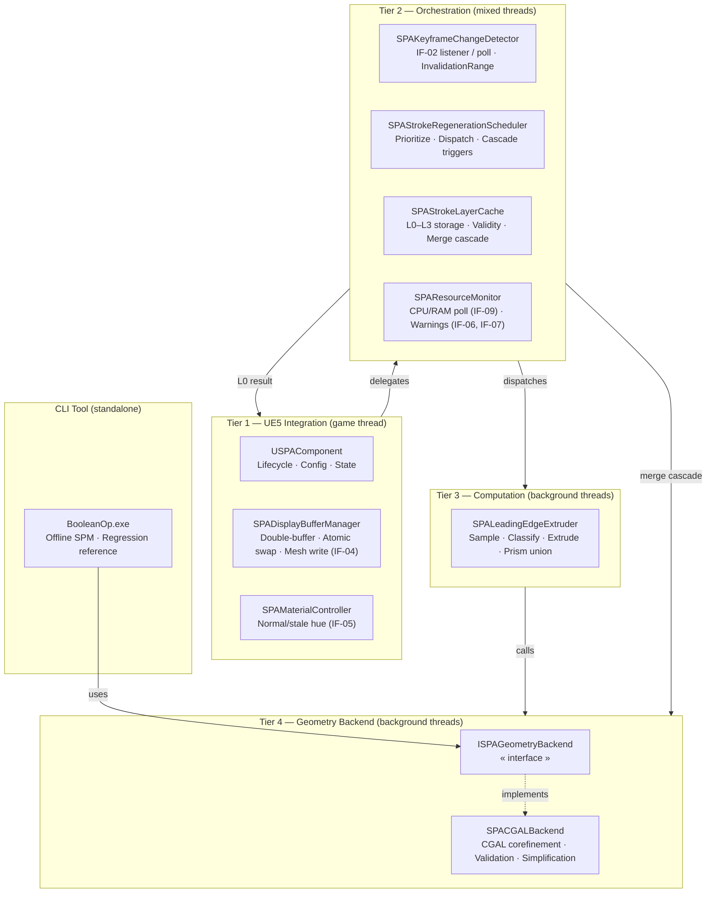
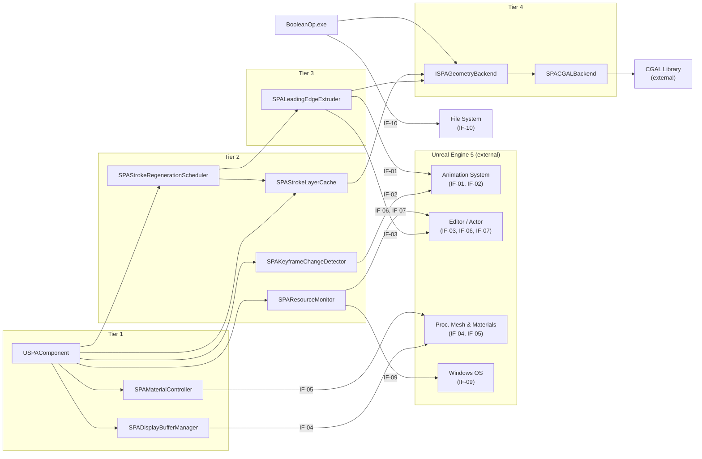
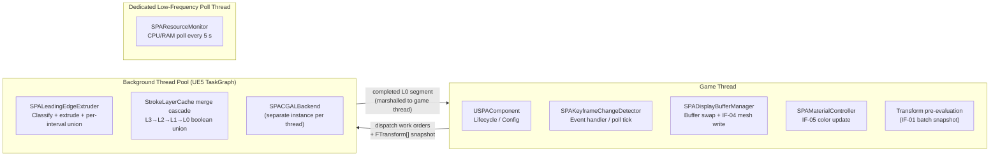

# Stage 8 — Architecture

**Project:** Swept Path Analysis (SPA)
**Status:** Draft — awaiting review
**Last updated:** 2026-04-22

---

## 1. Architectural Style

SPA uses a **layered pipeline** style organized into four tiers of decreasing coupling to the host environment. Each tier contains services (from Stage 7) whose threading model and UE5 API dependencies are homogeneous within that tier. Dependencies flow strictly downward — no tier calls upward.

| Tier | Layer Name | Services | Threading | UE5 Coupling |
|------|-----------|----------|-----------|--------------|
| 1 | **UE5 Integration** | `USPAComponent`, `SPAMaterialController`, `SPADisplayBufferManager` | Game thread only | High — direct UE5 API calls |
| 2 | **Orchestration** | `SPAKeyframeChangeDetector`, `SPAStrokeRegenerationScheduler`, `SPAStrokeLayerCache`, `SPAResourceMonitor` | Mixed (game thread + background coordination) | Medium — reads UE5 state; no render calls |
| 3 | **Computation** | `SPALeadingEdgeExtruder` | Background worker threads | Low — receives pre-evaluated data snapshots; no live UE5 object access |
| 4 | **Geometry Backend** | `ISPAGeometryBackend`, `SPACGALBackend` | Background worker threads | None — pure C++ / CGAL |

The CLI tool (`BooleanOp.exe`) shares Tier 4 and is otherwise independent of all other tiers.

---

## 2. Layer Diagram

---

## 3. Component Diagram

This diagram shows all SPA components and their direct dependencies. It refines the Stage 5 interface dependency map with layer boundaries and direction constraints.

---

## 4. Technology Selection

### 4.1 Geometry Backend — v1.0

| Option | Approach | Pros | Cons |
|--------|---------|------|------|
| **CGAL corefinement** *(selected)* | Exact-predicate boolean union via `PMP::corefine_and_compute_union` | Mathematically exact; proven robustness on closed manifold meshes; C++ native; already prototyped | Slowest of the four; EPICK kernel risks numerical failures on degenerate geometry; not GPU-accelerated |
| UE5 Geometry Scripting | UE5-native mesh boolean via `UGeometryScriptLibrary` | No external dependency; Editor-integrated; GPU path for some ops | Less robust than CGAL for non-manifold inputs; Blueprint-centric API; exact performance unknown |
| OpenVDB / voxel CSG | Convert to SDF; voxel union; reconstruct | Constant-time union regardless of mesh complexity; GPU-friendly | Approximate (discretized at voxel resolution); adds OpenVDB dependency; surface quality depends on voxel size |
| Convex hull / AABB approximation | Over-approximate swept volume analytically | Extremely fast; no library dependency | Not geometrically accurate enough for safety-critical collision analysis (fails SC-01) |

**Decision:** CGAL v1.0. The `ISPAGeometryBackend` interface isolates this choice so the backend can be replaced in v2.0 if Stage 11 spike data shows CGAL cannot meet NFR-03 latency targets.

### 4.2 SPM Rendering

| Option | Approach | Pros | Cons |
|--------|---------|------|------|
| **`UProceduralMeshComponent`** *(selected)* | Runtime-generated mesh sections updated via `CreateMeshSection_LinearColor` / `UpdateMeshSection_LinearColor` | Standard UE5 component; supports per-vertex color; easy to drive from C++; render pipeline handles LOD/culling | Vertex buffer upload is game-thread-bound; may stall frame on large meshes (R-17) |
| Geometry Script runtime mesh | `UDynamicMeshComponent` driven by Geometry Script | More modern API; built-in mesh editing ops | Newer, less stable API surface; Blueprint-oriented; harder to drive from background C++ |
| Static mesh rebuild | Reconstruct `FStaticMeshRenderData` per update | Best runtime render performance | Very high game-thread cost per rebuild; not designed for frequent updates |

**Decision:** `UProceduralMeshComponent` for v1.0. Profile buffer-swap cost in Stage 11; fall back to `UDynamicMeshComponent` if game-thread stall exceeds budget (R-17 mitigation).

### 4.3 Animation Transform Evaluation

| Option | Approach |
|--------|---------|
| **Batch pre-evaluation on game thread** *(selected)* | Evaluate all `SampleTransform[]` for the invalidated range on the game thread in one pass before dispatching background work (IF-01 fallback from Stage 5) |
| Per-call background evaluation | Call `EvaluateAnimation()` from each background extruder thread | Blocked by OQ-07 (thread safety unknown) |

**Decision:** Batch pre-evaluation. The full transform array at C-06 parameters is ~576 KB (Stage 6 §6); copying it once per rebuild is acceptable. Confirmed safe path until OQ-07 is resolved in Stage 11.

### 4.4 Keyframe Change Detection

| Option | Approach |
|--------|---------|
| **Push + polling fallback** *(selected)* | Prefer IF-02 push notification; fall back to 100 ms polling with animation-fingerprint comparison if push API is unavailable (OQ-06) |
| Push only | Only register for UE5 delegate | Blocked by OQ-06 |
| Polling only | Hash animation asset on every tick | Reliable but adds false-positive invalidation cost |

**Decision:** Dual-path detector (push preferred, poll fallback). Selected based on OQ-06 investigation summary in Stage 5 §5.

---

## 5. Architecture Decision Records

### ADR-01 — Four-Layer Stroke Cache (L0–L3) Over Flat Cache

**Status:** Accepted

**Context:** When a keyframe is edited, only the intervals touching that keyframe are geometrically changed. A flat cache (one monolithic SPM per timeline) would require recomputing the entire sweep on every edit. For a 120-second sequence at 0.05 s intervals that is 2,400 boolean union operations per edit.

**Decision:** Use a four-layer hierarchical cache where Layer-3 holds one segment per keyframe-bounded interval, Layer-2 merges pairs of L3 segments, Layer-1 merges pairs of L2 segments, and Layer-0 is the full-timeline SPM. On a keyframe edit, only the affected L3 segments (and their ancestors in the merge tree) are recomputed. Unaffected subtrees are reused without recomputation.

**Alternatives considered:**
- Flat cache with incremental diff — recomputing only the changed interval and re-unioning it into the full SPM; simpler but still requires a full-SPM union operation on every edit
- Two-level cache (per-keyframe-interval + full) — simpler than four levels; less reuse on sequences with many closely-spaced keyframe changes

**Consequences:** Increased implementation complexity in `SPAStrokeLayerCache` and `SPAStrokeRegenerationScheduler`; reduced recomputation cost on typical edit patterns; worst case (edit to a keyframe at the timeline midpoint) still requires O(log N) merge operations.

---

### ADR-02 — Abstract Geometry Backend Interface (`ISPAGeometryBackend`)

**Status:** Accepted

**Context:** CGAL is the v1.0 geometry backend, but its suitability for real-time UE5 operation at production mesh sizes is unproven (the Stage 11 spike is the first real test). If CGAL fails to meet NFR-03 latency, the project needs a migration path to UE5 Geometry Scripting, OpenVDB, or a custom solution.

**Decision:** All geometry operations (boolean union, mesh validation, simplification) are invoked through a pure virtual `ISPAGeometryBackend` C++ interface. `SPACGALBackend` is the only concrete implementation in v1.0. No code above Tier 4 includes CGAL headers.

**Alternatives considered:**
- Direct CGAL calls from the Extruder — simpler in v1.0 but creates a hard dependency that is expensive to break later
- Runtime-selectable backend via config — adds complexity; deferred to v2.0 if needed

**Consequences:** An additional indirection on every geometry call; the interface must be designed so it does not leak CGAL types into its signature (use `FMeshData` wrapper structs). Backend swap requires implementing the interface, not modifying any Tier 1–3 code.

---

### ADR-03 — Double-Buffer Display (DisplayBuffer + UpdateBuffer)

**Status:** Accepted

**Context:** SPM recomputation runs on background threads and can take seconds for a full-timeline rebuild. The viewport must show a continuous overlay throughout. If the geometry write and the render read are not synchronized, the animator sees a flickering or blank overlay during recomputation.

**Decision:** Maintain two mesh buffers: `DisplayBuffer` (always valid; visible in viewport) and `UpdateBuffer` (receives new SPM while background computation runs). On L0 completion, the swap is atomic from the game thread's perspective — `UpdateBuffer` is promoted to `DisplayBuffer` in a single pointer/fence operation between render frames. The previous `DisplayBuffer` mesh is shown with the stale hue until the swap fires.

**Alternatives considered:**
- Single buffer with mesh-section clear during update — causes visible blank frames
- Triple-buffering — unnecessary for this use case; swap latency is bounded by one game-thread tick

**Consequences:** Two copies of the full L0 SPM exist in memory simultaneously (~20–80 MB each at C-06 parameters — within the 256 MB budget per Stage 6 §6). The DisplayBuffer is never written by background threads, eliminating the primary data-race vector (R-23 mitigation).

---

### ADR-04 — Tier Isolation: No UE5 Object Access Below Tier 2

**Status:** Accepted

**Context:** UE5 `UObject`-derived types (`UAnimSequence`, `UStaticMesh`, `UProceduralMeshComponent`) are managed by the UE5 garbage collector. Accessing them from background threads without game-thread locking risks reading freed or partially collected objects, which causes non-deterministic crashes.

**Decision:** No service in Tier 3 or Tier 4 holds a reference to any `UObject`. Before dispatching background work, Tier 2 snapshots all required data into plain C++ structures (`TArray<FTransform>`, `FMeshData`) and passes ownership of the snapshot to the background thread. Background threads operate entirely on these plain-old-data snapshots.

**Alternatives considered:**
- UE5 `FGCObjectScopeGuard` to pin objects during background access — more complex; ties background thread lifetime to GC cycles
- Game-thread-only computation — eliminates the race but cannot meet NFR-03 latency requirements

**Consequences:** One `TArray<FTransform>` copy (~576 KB at C-06) per rebuild dispatch; this is acceptable. Background threads have no GC entanglement. Mesh snapshot size depends on LOD-0 polygon count of the actor mesh.

---

### ADR-05 — CGAL EPICK Kernel for v1.0; EPECK Available as Fallback

**Status:** Accepted

**Context:** CGAL offers two kernels: EPICK (`Exact_predicates_inexact_constructions_kernel`) is faster but can produce incorrect results on degenerate geometry; EPECK (`Exact_predicates_exact_constructions_kernel`) is fully robust but requires GMP/MPFR and is significantly slower.

**Decision:** Use EPICK in `SPACGALBackend` for v1.0. The primary input geometry (actor static meshes at LOD 0) is expected to be well-formed (closed, manifold, non-self-intersecting). Add a compile-time switch to build `SPACGALBackend` with EPECK for regression testing and edge-case investigation. If Stage 11 spike data shows EPICK failures on production assets, switch the production default to EPECK.

**Alternatives considered:**
- EPECK by default — more robust but potentially too slow for NFR-03 real-time target
- Hybrid (EPICK first; retry with EPECK on failure) — adds complexity; deferred to v2.0

**Consequences:** If an input mesh has degenerate faces (zero-area triangles, T-junctions), EPICK may silently produce incorrect output rather than an error. The `ISPAGeometryBackend` contract requires the extruder to validate `PrismVolume` closedness before submission (DC-08), which catches the most common degenerate cases.

---

## 6. Threading Model Summary

Key constraints:
- **Game thread**: all UE5 `UObject` access, all render calls (IF-04, IF-05), buffer swap
- **Background threads**: all CGAL operations; each thread uses its own `SPACGALBackend` instance (ADR-02 + R-14 from Stage 5)
- **Poll thread**: `SPAResourceMonitor` only; output (IF-06, IF-07) is marshalled to game thread before logging

---

## 7. Open Questions Carried Forward

| ID | Question | Blocking? | Target |
|----|----------|-----------|--------|
| OQ-06 | UE5 5.4+ push notification API for keyframe changes (Stage 5 investigation) | No — polling fallback adopted in ADR | Stage 11 spike |
| OQ-07 | `UAnimSequence::EvaluateAnimation()` batch-call throughput for 7,200 sample points | No — batch pre-evaluation adopted in §4.3 | Stage 11 spike |
| OQ-10 | Merge cascade trigger ordering: immediate-on-L3-arrival vs scheduler-orchestrated | No — deferred to Stage 10 implementation map | Stage 10 |
| OQ-11 | Can `SPACGALBackend` be built with EPECK and still meet NFR-03 latency (3 s for single-keyframe edit)? | No — EPICK default adopted in ADR-05 | Stage 11 spike |

---

## 8. Risks Identified at This Stage

| ID | Risk | Likelihood | Impact | Mitigation |
|----|------|-----------|--------|------------|
| R-25 | CGAL EPICK produces a topologically invalid output mesh (non-closed, self-intersecting) for well-formed inputs under floating-point edge cases; the extruder stores a corrupt L3 segment silently | Low | Medium | `ISPAGeometryBackend` validates the output mesh (closedness check, optional self-intersection check) before returning success; corrupt results are rejected and the segment stays STALE with an ERROR state |
| R-26 | The `ISPAGeometryBackend` interface signature is too narrow for a future OpenVDB backend (which operates on SDFs, not surface meshes), requiring a breaking API change | Low | Medium | Interface uses `FMeshData` wrapper structs rather than CGAL types; these can carry both surface-mesh and voxel-grid representations in v2.0 without changing callers |
| R-27 | UE5 TaskGraph thread pool contention: `SPALeadingEdgeExtruder` dispatches many parallel tasks that compete with UE5's own background jobs (streaming, async loading), causing unpredictable latency spikes | Medium | Medium | Profile in Stage 11; if contention is observed, limit SPA to a fixed number of concurrent TaskGraph tasks or use a dedicated `FQueuedThreadPool` instance |
| R-28 | Stage 11 spike shows CGAL EPICK cannot meet the 3-second single-keyframe latency target at C-06 parameters (150-polygon brush, 60-second sequence, 0.05 s interval); the architecture requires a backend swap before v1.0 ships | Medium | High | Architecture explicitly supports this via ADR-02; UE5 Geometry Scripting or OpenVDB backend can be substituted without touching Tier 1–3 code; identified as the primary project risk since Stage 3 |
