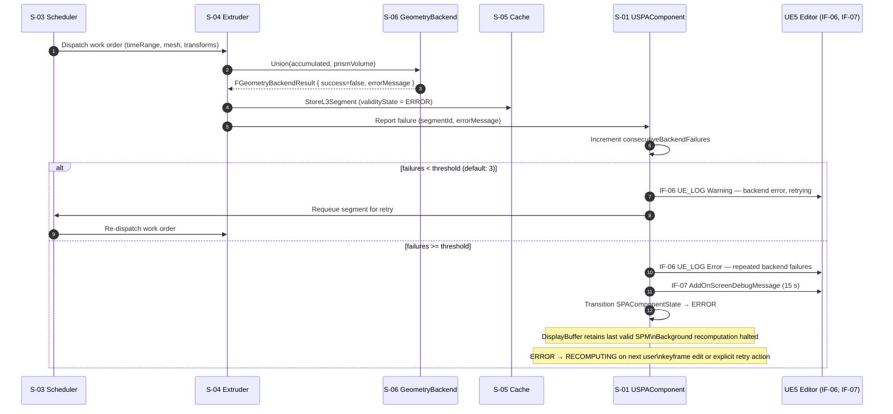

# Stage 9 — Synthesize & Baseline Design Artifacts

**Project:** Swept Path Analysis (SPA)
**Status:** Draft — awaiting review
**Last updated:** 2026-04-22

---

## Purpose

Stage 9 is a synthesis gate. The UML diagrams in §1 and §2 distill the Stage 5–8 artifacts into a single, self-consistent design package. The design review checklist in §3 confirms that every functional requirement, non-functional requirement, and external interface has a named design owner before Stage 10 (implementation mapping) begins. No new design decisions are made here — open items are carried forward with explicit owners.

---

## 1. UML Class Diagram

```plantuml
@startuml SPA-ClassDiagram
skinparam classAttributeIconSize 0
skinparam groupInheritance 2
hide empty members

' ───────────────────────────────────────────────────
' Tier 1 — UE5 Integration
' ───────────────────────────────────────────────────
package "Tier 1 — UE5 Integration" #DDEEFF {

  class USPAComponent {
    - config : SPAComponentConfig
    - state : SPAComponentState
    - detector : SPAKeyframeChangeDetector
    - scheduler : SPAStrokeRegenerationScheduler
    - cache : SPAStrokeLayerCache
    - bufferMgr : SPADisplayBufferManager
    - materialCtrl : SPAMaterialController
    - resourceMon : SPAResourceMonitor
    - brushMesh : FMeshData
    + OnRegister()
    + BeginDestroy()
    + TickComponent(deltaTime : float)
    + SetConfig(config : SPAComponentConfig)
    + ToggleOverlay(enabled : bool)
    - SnapshotBrushMesh()
    - SnapshotTransforms(range : FInvalidationRange) : TArray<FTransform>
  }

  struct SPAComponentConfig << (S,#AAFFAA) USTRUCT >> {
    + enableOverlay : bool
    + preFrameDuration : float
    + postFrameDuration : float
    + sampleInterval : float
    + normalColor : FLinearColor
    + staleColor : FLinearColor
    + cpuWarningThreshold : float
    + ramWarningThresholdMB : int
  }

  struct SPAComponentState {
    + overallState : EOverallState
    + isRecomputing : bool
    + isDisplayStale : bool
    + lastValidTimestamp : float
    + lastErrorMessage : FString
    + consecutiveBackendFailures : int
  }

  enum EOverallState {
    DISABLED
    IDLE
    RECOMPUTING
    ERROR
  }

  class SPADisplayBufferManager {
    - displayBuffer : FDisplayBufferSlot
    - updateBuffer : FUpdateBufferSlot
    - proceduralMesh : UProceduralMeshComponent*
    + OnLayer0Ready(segment : FStrokeSegment)
    + WriteToProceduralMesh(mesh : FMeshData)
    + SwapBuffers()
    + Initialize(mesh : UProceduralMeshComponent*)
  }

  class SPAMaterialController {
    - materialInstance : UMaterialInstanceDynamic*
    - normalColor : FLinearColor
    - staleColor : FLinearColor
    + SetStale()
    + SetNormal()
    + Initialize(material : UMaterialInstanceDynamic*)
  }
}

' ───────────────────────────────────────────────────
' Tier 2 — Orchestration
' ───────────────────────────────────────────────────
package "Tier 2 — Orchestration" #FFEEDD {

  class SPAKeyframeChangeDetector {
    - timeLayerIndex : FTimeLayerIndex
    - animFingerprint : uint32
    - pollTimerHandle : FTimerHandle
    + RegisterForNotifications(anim : UAnimSequence*)
    + UnregisterNotifications()
    + PollForChanges()
    + ComputeInvalidationRange(changeEvent) : FInvalidationRange
    - HashAnimationState(anim : UAnimSequence*) : uint32
  }

  class SPAStrokeRegenerationScheduler {
    - workQueue : TQueue<FWorkOrder>
    - activeTaskCount : TAtomic<int>
    - maxConcurrentTasks : int
    + OnInvalidationRange(range : FInvalidationRange)
    + DispatchNextBatch()
    + OnSegmentComplete(result : FStrokeSegment)
    + CancelAndRequeue(range : FInvalidationRange)
    + DrainAndStop()
  }

  class SPAStrokeLayerCache {
    - layer3 : TArray<FStrokeSegment>
    - layer2 : TArray<FStrokeSegment>
    - layer1 : TArray<FStrokeSegment>
    - layer0 : FStrokeSegment
    - timeIndex : FTimeLayerIndex
    - perLayerMutex : TArray<FCriticalSection>
    + Initialize(timeIndex : FTimeLayerIndex)
    + MarkStale(range : FInvalidationRange)
    + StoreL3Segment(seg : FStrokeSegment)
    + GetDirtyL3Ranges() : TArray<FTimeRange>
    + GetLayer0Segment() : FStrokeSegment
    + TriggerMergeCascade(backend : ISPAGeometryBackend*)
    + IsFullyValid() : bool
  }

  class SPAResourceMonitor {
    - cpuThreshold : float
    - ramThresholdMB : int
    - pollIntervalSec : float
    + Start()
    + Stop()
    # OnPollTick()
    # CheckThresholds(cpuPct : float, ramMB : int)
    # EmitWarning(message : FString)
  }
}

' ───────────────────────────────────────────────────
' Tier 3 — Computation
' ───────────────────────────────────────────────────
package "Tier 3 — Computation" #FFEEEE {

  class SPALeadingEdgeExtruder {
    - epsilon : float
    + Extrude(order : FWorkOrder, backend : ISPAGeometryBackend*) : FStrokeSegment
    - ClassifyVertices(mesh : FMeshData, d : TArray<FVector>, epsilon : float) : TBitArray
    - BuildPrismVolume(leading : TBitArray, mesh : FMeshData, t0 : FTransform, t1 : FTransform) : FMeshData
    - ValidatePrismClosure(prism : FMeshData) : bool
  }
}

' ───────────────────────────────────────────────────
' Tier 4 — Geometry Backend
' ───────────────────────────────────────────────────
package "Tier 4 — Geometry Backend" #EEFFEE {

  interface ISPAGeometryBackend {
    + {abstract} Union(a : FMeshData, b : FMeshData) : FGeometryBackendResult
    + {abstract} Validate(mesh : FMeshData) : bool
    + {abstract} Simplify(mesh : FMeshData, targetFaces : int) : FGeometryBackendResult
    + {abstract} CleanUp(mesh : FMeshData) : FGeometryBackendResult
  }

  class SPACGALBackend {
    + Union(a, b) : FGeometryBackendResult
    + Validate(mesh) : bool
    + Simplify(mesh, targetFaces) : FGeometryBackendResult
    + CleanUp(mesh) : FGeometryBackendResult
    - ToCGALMesh(data : FMeshData) : Surface_mesh
    - FromCGALMesh(sm : Surface_mesh) : FMeshData
  }
}

' ───────────────────────────────────────────────────
' Data Transfer Objects
' ───────────────────────────────────────────────────
package "Data Transfer Objects" #F8F8F8 {

  struct FMeshData {
    + vertices : TArray<FVector>
    + normals : TArray<FVector>
    + indices : TArray<int32>
    + IsEmpty() : bool
  }

  struct FStrokeSegment {
    + layerIndex : int
    + timeRangeStart : float
    + timeRangeEnd : float
    + validityState : ESegmentValidity
    + mesh : FMeshData
  }

  struct FTimeRange {
    + start : float
    + end : float
  }

  struct FTimeLayerIndex {
    + layer3Boundaries : TArray<float>
    + layer2Boundaries : TArray<float>
    + BuildFromSequence(anim : UAnimSequence*)
    + BoundariesContaining(range : FTimeRange) : TArray<FTimeRange>
  }

  struct FInvalidationRange {
    + start : float
    + end : float
    + ExpandToKeyframeBoundaries(index : FTimeLayerIndex) : FInvalidationRange
  }

  struct FGeometryBackendResult {
    + success : bool
    + resultMesh : FMeshData
    + errorMessage : FString
  }

  struct FWorkOrder {
    + timeRange : FTimeRange
    + brushMeshSnapshot : FMeshData
    + transformSnapshot : TArray<FTransform>
    + segmentId : int32
  }

  enum ESegmentValidity {
    VALID
    STALE
    COMPUTING
    ERROR
  }
}

' ───────────────────────────────────────────────────
' CLI Tool (separate binary; shares Tier 4)
' ───────────────────────────────────────────────────
package "CLI Tool" #F0F0F0 {
  class BooleanOpCLI {
    + main(argc, argv) : int
    - LoadConfig(path) : FCliConfig
    - LoadMesh(path) : FMeshData
    - LoadTransforms(path) : TArray<FTransform>
    - Run(config, backend : ISPAGeometryBackend*) : FMeshData
  }
}

' ───────────────────────────────────────────────────
' Relationships
' ───────────────────────────────────────────────────
USPAComponent *-down- SPAComponentConfig
USPAComponent *-down- SPAComponentState
USPAComponent *-down- SPAKeyframeChangeDetector
USPAComponent *-down- SPAStrokeRegenerationScheduler
USPAComponent *-down- SPAStrokeLayerCache
USPAComponent *-down- SPADisplayBufferManager
USPAComponent *-down- SPAMaterialController
USPAComponent *-down- SPAResourceMonitor

SPAComponentState --> EOverallState
FStrokeSegment --> ESegmentValidity

SPAKeyframeChangeDetector ..> FInvalidationRange : produces
SPAKeyframeChangeDetector --> FTimeLayerIndex

SPAStrokeRegenerationScheduler ..> SPAStrokeLayerCache : reads/writes
SPAStrokeRegenerationScheduler ..> SPALeadingEdgeExtruder : dispatches
SPAStrokeRegenerationScheduler ..> FWorkOrder : creates

SPAStrokeLayerCache o-- FStrokeSegment : stores (L0–L3)
SPAStrokeLayerCache --> FTimeLayerIndex : owns
SPAStrokeLayerCache ..> ISPAGeometryBackend : merge cascade

SPALeadingEdgeExtruder ..> ISPAGeometryBackend : calls
SPALeadingEdgeExtruder ..> FWorkOrder : consumes
SPALeadingEdgeExtruder ..> FStrokeSegment : produces

ISPAGeometryBackend <|.. SPACGALBackend : implements

SPADisplayBufferManager ..> FStrokeSegment : reads L0
SPADisplayBufferManager ..> SPAMaterialController : notifies
SPADisplayBufferManager ..> FMeshData : writes to UProceduralMesh

BooleanOpCLI ..> ISPAGeometryBackend : uses

@enduml
```



---

## 2. Supplementary Sequence Diagrams

Stages 7 covered the two primary flows (keyframe change and initialization). The diagrams below cover the two remaining behavioral paths.

### 2.1 Backend Error and Retry Path

Applies when `ISPAGeometryBackend::Union()` returns `success = false` or throws during Layer-3 generation or merge cascade.



### 2.2 Overlay Toggle — Disable and Re-enable

Covers the `ToggleOverlay(false)` → `ToggleOverlay(true)` round trip, including the warm-cache fast path.

```mermaid
sequenceDiagram
    autonumber
    actor Animator
    participant UE5E as UE5 Details Panel
    participant COMP as S-01 USPAComponent
    participant KCD as S-02 Detector
    participant SRS as S-03 Scheduler
    participant SLC as S-05 Cache
    participant DBM as S-07 DisplayBufferManager
    participant UE5M as UE5 Proc. Mesh

    Animator->>UE5E: Set Enable SPM Overlay = false
    UE5E->>COMP: SetConfig (enableOverlay=false)
    COMP->>SRS: DrainAndStop() — cancel in-flight tasks
    COMP->>KCD: UnregisterNotifications()
    COMP->>DBM: Hide overlay (set mesh invisible)
    UE5M-->>Animator: Overlay hidden
    COMP->>COMP: Transition SPAComponentState → DISABLED
    Note over COMP: Cache retains all StrokeSegments;\nno memory freed — warm-cache preserved

    Animator->>UE5E: Set Enable SPM Overlay = true
    UE5E->>COMP: SetConfig (enableOverlay=true)
    COMP->>KCD: RegisterForNotifications()
    COMP->>SLC: IsFullyValid()?

    alt Cache is fully valid (no keyframe edits while disabled)
        SLC-->>COMP: true
        COMP->>DBM: Show overlay with existing L0 segment
        UE5M-->>Animator: Overlay visible immediately (no recompute)
        COMP->>COMP: Transition → IDLE
    else Cache has stale segments
        SLC-->>COMP: false
        COMP->>COMP: Transition → RECOMPUTING
        COMP->>DBM: Show existing L0 with stale hue
        COMP->>SRS: Dispatch dirty segments (partial or full rebuild)
        Note over SRS: Follows standard keyframe-change path\n(Stage 7 §3, steps 9–22)
    end
```

---

## 3. Design Review Checklist

### 3.1 Functional Requirements Coverage

| FR Group | Requirements | Design Owner | Status |
|----------|-------------|--------------|--------|
| Animation Data Access | FR-01 – FR-05 | `USPAComponent` (IF-03 mesh read); `SPALeadingEdgeExtruder` (IF-01 batch snapshot); `SPAKeyframeChangeDetector` (IF-02) | ✅ Covered |
| Leading-Edge Extrusion | FR-06 – FR-13 | `SPALeadingEdgeExtruder` (classify, prism, per-step simplification via `ISPAGeometryBackend::CleanUp`) | ✅ Covered |
| Stroke Layer Cache | FR-14 – FR-19 | `SPAStrokeLayerCache` + `SPAStrokeRegenerationScheduler` + `FTimeLayerIndex` | ✅ Covered |
| Boolean Union & Post-Processing | FR-20 – FR-23 | `ISPAGeometryBackend::Union` + `CleanUp` + `Simplify`; parallel dispatch via `SPAStrokeRegenerationScheduler` (FR-21) | ✅ Covered |
| UE5 Component Integration | FR-24 – FR-29 | `USPAComponent` (UActorComponent subclass); `SPADisplayBufferManager` (UProceduralMeshComponent); ADR-04 for Editor-without-PIE | ✅ Covered |
| SPM Display Buffering & Staleness | FR-40 – FR-44 | `SPADisplayBufferManager` (double-buffer, atomic swap, FR-42); `SPAMaterialController` (hue shift FR-43/44) | ✅ Covered |
| Warnings & Diagnostics | FR-30 – FR-33 | `USPAComponent` (mesh type check FR-30); `SPAResourceMonitor` (FR-31); IF-06/IF-07 callers (FR-32); `SPAStrokeRegenerationScheduler` (FR-33 "Recomputing…" log) | ✅ Covered |
| Geometry Backend Interface | FR-34 – FR-36 | `ISPAGeometryBackend` interface (FR-34/36); `SPACGALBackend` (FR-35); ADR-02 backend swap path | ✅ Covered |
| CLI Reference Tool | FR-37 – FR-39 | `BooleanOpCLI` class + `ISPAGeometryBackend` shared path; benchmark output in `Run()` | ✅ Covered |
| v2.0 Deferred | FR-V2-01 – FR-V2-04 | `SPAResourceMonitor` plumbed for FR-V2-03 poll frequency; `IAnimationDataProvider` interface noted for FR-V2-04 Live Link | ✅ Architecture does not block |

### 3.2 Non-Functional Requirements Coverage

| NFR | Requirement | Design Decision | Status |
|-----|------------|-----------------|--------|
| NFR-01 Accuracy | No aliasing gaps; topologically equivalent SPM | Leading-edge classification per interval (FR-06–10); CGAL exact-predicate union (ADR-05) | ✅ Covered |
| NFR-02 Output Mesh Quality | Closed, manifold, no degenerate faces | `ISPAGeometryBackend::Validate()` on every segment output; `CleanUp()` post-processing | ✅ Covered |
| NFR-03 Update Latency ≤ 3 s | Single-keyframe edit at C-06 | Four-layer cache limits recompute to affected L3 segments (ADR-01); parallel dispatch (FR-21); Stage 11 spike required | ⚠️ Architecture supports; confirmed in Stage 11 |
| NFR-04 Memory ≤ 256 MB | Cache footprint at C-06 | Sizing analysis: ~50–150 MB (Stage 6 §6); double-buffer adds 1× L0 copy (~20–80 MB); L3 segment cap (R-19 mitigation) | ✅ Within budget |
| NFR-05 Scale Target | All NFRs at C-06 parameters | C-06: 150-poly brush, 30 sps, 4 min → 7,200 samples; used as sizing baseline throughout | ✅ Covered |
| NFR-06 Backend Modularity | Zero changes to non-backend code for swap | ADR-02 — `ISPAGeometryBackend` interface; `FMeshData` wrapper keeps CGAL types in Tier 4 only | ✅ Covered |
| NFR-07 Thread Safety | No data races on cache under parallel L3 generation | Per-layer mutexes in `SPAStrokeLayerCache`; ADR-03 double-buffer; ADR-04 no UObject below Tier 2 | ✅ Covered |
| NFR-08 Graceful Degradation | Retain last valid SPM on backend error | Error/retry path (§2.1 above); `consecutiveBackendFailures` threshold; STALE/ERROR states in cache | ✅ Covered |
| NFR-09 Editor Compatibility UE5.4+ | Live Editor viewport, no PIE | `OnRegister()` entry point (not `BeginPlay`); IF-02 push+poll dual-path; Stage 11 spike required | ⚠️ Architecture supports; OQ-06 confirmed in Stage 11 |
| NFR-10 Build Isolation | UE5 ThirdParty module system for CGAL | `SPACGALBackend` in dedicated ThirdParty module; no CGAL headers above Tier 4 | ✅ Covered |
| NFR-11 Disabled Overhead < 0.05 ms | `TickComponent` when overlay is off | `ToggleOverlay(false)` drains scheduler, unregisters notifications, hides mesh; only guard check per tick | ✅ Covered |
| NFR-12 Topology Stability | Repeated regeneration = identical output | Deterministic inputs (same transforms snapshot, same brush mesh); CGAL exact predicates; no mutable global state in Tier 4 | ✅ Covered |

### 3.3 External Interface Coverage

| Interface | Direction | Design Owner | Status |
|-----------|-----------|--------------|--------|
| IF-01 Animation Transform Evaluation | SPA reads UE5 | `USPAComponent::SnapshotTransforms()` — batch on game thread | ✅ |
| IF-02 Keyframe Change Notification | UE5 pushes / SPA polls | `SPAKeyframeChangeDetector` — dual path (push + 100 ms poll fallback) | ✅ |
| IF-03 Actor Mesh Geometry Access | SPA reads UE5 | `USPAComponent::SnapshotBrushMesh()` — once at init, on mesh change | ✅ |
| IF-04 Procedural Mesh Write | SPA writes UE5 | `SPADisplayBufferManager::WriteToProceduralMesh()` — game thread | ✅ |
| IF-05 Material Parameter Update | SPA writes UE5 | `SPAMaterialController::SetStale()` / `SetNormal()` — game thread | ✅ |
| IF-06 UE5 Output Log | SPA writes | `UE_LOG(LogSPA, ...)` — called from `USPAComponent`, `SPAResourceMonitor` | ✅ |
| IF-07 On-Screen Debug Overlay | SPA writes | `SPAResourceMonitor::EmitWarning()` + error path in `USPAComponent` | ✅ |
| IF-08 CGAL Geometry Backend | SPA calls CGAL | `SPACGALBackend` — separate instance per background thread | ✅ |
| IF-09 Windows System Resource Metrics | SPA reads OS | `SPAResourceMonitor::OnPollTick()` — `FPlatformMemory` / `FPlatformTime` | ✅ |
| IF-10 File System (CLI only) | CLI reads/writes | `BooleanOpCLI::LoadMesh()` / `Run()` — standard C++ I/O + CGAL I/O | ✅ |

### 3.4 Architecture Decision Record Status

| ADR | Decision | Consequence Check |
|-----|---------|------------------|
| ADR-01 Four-Layer Cache | Hierarchical L0–L3 | `FTimeLayerIndex`, per-layer mutex array, merge cascade in `SPAStrokeLayerCache` — reflected in class diagram ✅ |
| ADR-02 Backend Interface | `ISPAGeometryBackend` pure virtual | `FMeshData` wrapper structs used everywhere; no CGAL includes above Tier 4 ✅ |
| ADR-03 Double-Buffer Display | `FDisplayBufferSlot` + `FUpdateBufferSlot` | `SPADisplayBufferManager` owns both slots; swap on game thread; `SPAMaterialController` notified ✅ |
| ADR-04 Tier Isolation | No UObject below Tier 2 | `FWorkOrder` carries plain-C++ snapshots only; `SPALeadingEdgeExtruder` and `SPACGALBackend` have no UE5 includes ✅ |
| ADR-05 EPICK kernel / EPECK fallback | Compile-time switch | `SPACGALBackend` implementation detail; interface unchanged ✅ |

### 3.5 Open Questions Status Before Stage 10

| ID | Question | Impact on Stage 10 | Resolution Target |
|----|----------|--------------------|-------------------|
| OQ-06 | UE5 5.4+ push notification API | `SPAKeyframeChangeDetector` — polling fallback is the safe implementation path; push path can be added post-spike without interface changes | Stage 11 spike |
| OQ-07 | `EvaluateAnimation()` batch throughput | `USPAComponent::SnapshotTransforms()` — implemented as game-thread batch; confirmed approach regardless of OQ-07 result | Stage 11 spike |
| OQ-10 | Merge cascade trigger ordering | `SPAStrokeLayerCache::TriggerMergeCascade()` internal policy — design can proceed with immediate-on-completion policy; scheduling policy is an internal implementation choice | Stage 10 |
| OQ-11 | EPECK meets NFR-03 latency | `SPACGALBackend` compile switch; no Stage 10 blocker | Stage 11 spike |

**Stage 10 gate:** All four open questions are resolved-or-deferred-to-Stage-11. None block Stage 10 implementation mapping.

---

## 4. Design Baseline Declaration

The following artifacts are collectively baselined at Stage 9. Changes to any of them after this point require a formal revision (updated stage document + commit):

| Artifact | Document | Baseline Status |
|----------|----------|----------------|
| Mission, Vision & Success Criteria | `01-mission-vision.md` | Baselined |
| Stakeholders & Use Cases | `02-stakeholders-use-cases.md` | Baselined |
| Functional & Non-Functional Requirements | `03-requirements.md` | Baselined |
| V&V Strategy & Acceptance Criteria | `04-validation-strategy.md` | Baselined |
| System Boundaries & External Interfaces | `05-system-boundaries.md` | Baselined |
| Abstract Data Model | `06-data-model.md` | Baselined |
| Abstract Functional Model | `07-functional-model.md` | Baselined |
| Architecture | `08-architecture.md` | Baselined |
| **Design Baseline (this document)** | **`09-design-baseline.md`** | **Baselined** |

**Authorized to proceed to Stage 10:** Yes — all FR groups have named design owners, all NFRs have architectural decisions, all interfaces have design owners, all ADRs are accepted, all open questions are resolved or explicitly deferred to Stage 11 with no Stage 10 blockers.

---

## 5. Risks Identified at This Stage

| ID | Risk | Likelihood | Impact | Mitigation |
|----|------|-----------|--------|------------|
| R-29 | The `FMeshData` wrapper struct (used across all tier boundaries) may be too coarse for future backends that operate on non-surface representations (e.g., OpenVDB SDFs or half-edge structures), requiring a breaking interface change | Low | Medium | `FMeshData` is defined as the canonical exchange format; v2.0 backends that need richer data can extend it via an optional `FMeshMetadata` payload rather than changing the primary fields |
| R-30 | The `FWorkOrder::transformSnapshot` copy-per-dispatch strategy (ADR-04) produces one `TArray<FTransform>` copy per dirty L3 segment; for a full-timeline rebuild with 100 L3 segments this is 100 × 576 KB = ~57 MB of temporary allocations | Medium | Medium | Only copy the transforms covering the L3 segment's time range, not the full timeline; at C-06 parameters with 100 L3 segments each covering ~2.4 seconds: 100 × (72 transforms × 80 bytes) ≈ 576 KB total — well within budget |
| R-31 | `SPAStrokeLayerCache::TriggerMergeCascade()` calls `ISPAGeometryBackend` for L3→L2 merges from whatever thread delivered the L3 result; if the scheduler dispatches this on a TaskGraph thread, the backend is called in a nested way that may exhaust the thread pool | Low | Medium | Merge cascade operations are dispatched as separate TaskGraph tasks rather than called inline; `TriggerMergeCascade` enqueues a merge work order to the scheduler rather than calling the backend directly |
